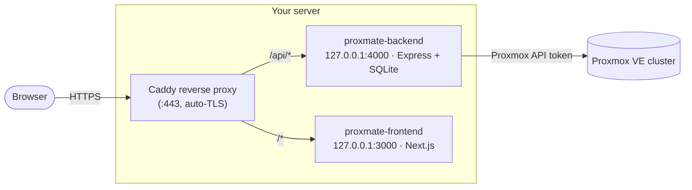
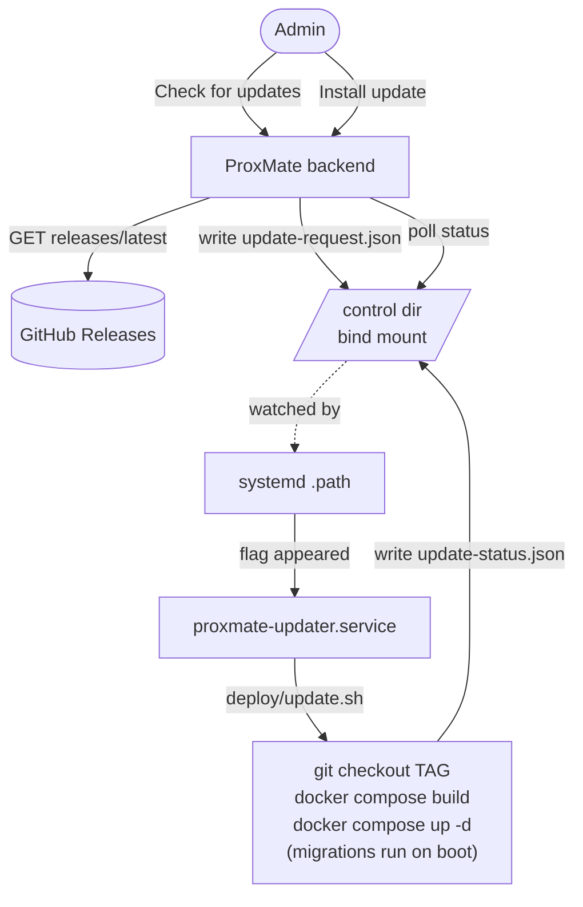
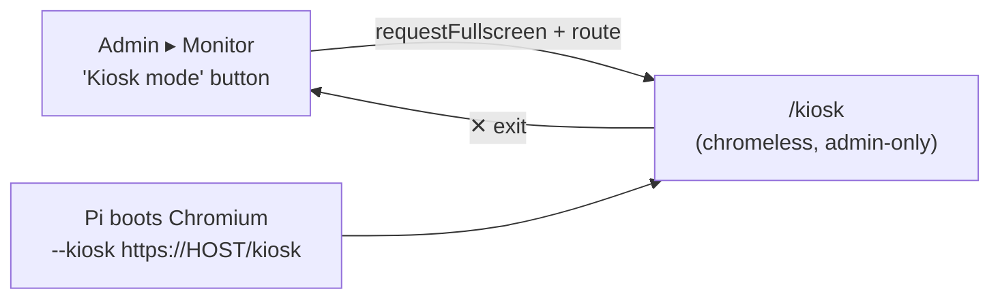

# ProxMate — Production Deployment Runbook

A step-by-step guide to deploying a production-ready ProxMate on your own
infrastructure: HTTPS, tenant network isolation, SMTP, Keycloak SSO, and all
two-step-authentication methods. Follow it top to bottom.

> **Why HTTPS is non-negotiable here:** passkeys (WebAuthn), `Secure` session
> cookies, and the OIDC SSO redirect all require a secure context. The whole
> deployment is built around **one HTTPS domain** behind a reverse proxy.

---

## 0. Target topology



- **One public domain** (e.g. `proxmate.example.com`). Frontend at `/`, API at `/api`.
  Same-origin ⇒ first-party cookies, passkey RP ID = the domain, SSO callback on the
  same domain. This avoids every cross-origin cookie headache.
- The backend reaches the **Proxmox cluster** over your management network using an
  API token. ProxMate never stores your Proxmox password.

---

## 1. Prerequisites

**On the server that will host ProxMate:**
- [ ] Linux host with Docker Engine + Docker Compose v2 (`docker compose version`).
- [ ] A domain/subdomain (`proxmate.example.com`) with an **A/AAAA record** pointing at the server's public IP.
- [ ] Ports **80 + 443** open to the internet (for Caddy + ACME). The app ports (3000/4000) stay bound to `127.0.0.1`.
- [ ] Outbound reachability to your **Proxmox API** (`https://<pve-host>:8006`) and, if used, your **Keycloak** and **SMTP relay**.

**On the Proxmox side:**
- [ ] A dedicated **API token** for ProxMate (see §2.2). 
- [ ] Decided on your **tenant isolation** model (see §2.1) — ideally a dedicated VLAN/SDN bridge.

**You'll generate/collect along the way:** `ENCRYPTION_KEY`, the Proxmox token id+secret, SMTP creds, and Keycloak client id+secret.

---

## 2. Network, VLAN & tenant isolation (Proxmox side)

ProxMate gives every tenant VM a per-VM Proxmox firewall (`policy_in=DROP`,
mac/ip-filter on, DNS to the gateway allowed, RFC1918 dropped, internet allowed).
**These rules only take effect once the Proxmox *cluster* firewall is enabled** —
ProxMate can do that for you safely from the admin UI (§7.3).

### 2.1 Choose an isolation model

- **Good — shared bridge + per-VM firewall + cluster firewall on.** Works on a
  default `vmbr0`. ProxMate's per-VM rules block tenant-to-tenant traffic once the
  cluster firewall is enforced.
- **Best — a dedicated VLAN or SDN zone for tenant VMs.** Put tenant NICs on an
  isolated VLAN (e.g. tag 50) or a Proxmox **SDN VNet** so tenants are L2-isolated
  from your management network by design.
  - Datacenter ▸ SDN ▸ Zones → add a **VLAN** (or **Simple**) zone; add a **VNet**
    (e.g. `tenants`, VLAN tag 50); **Apply**.
  - Set ProxMate's default bridge to that VNet in admin **Settings ▸ VM defaults**
    after first run.
- Keep the **Proxmox management interface (8006) and SSH on a separate VLAN/subnet**
  the tenants can't reach.

### 2.2 Create the ProxMate API token (avoid the #1 pitfall)

Proxmox tokens default to **Privilege Separation ON**, which gives the token *no*
permissions even for root — storage lists come back empty and VM creation 403s.

```bash
# On a Proxmox node (as root). Create a user + token, OR use root@pam.
pveum user token add root@pam proxmate --privsep 0       # privsep OFF
# → copy the displayed token VALUE now; it is shown only once.
```
You'll enter `root@pam!proxmate` as the **Token ID** and that value as the **Secret**
during OOBE (§7).

> Prefer least privilege? You can scope a token with a role on a pool instead — but
> note the per-tenant Pool/ACL least-privilege model is still being validated
> (tracked separately). For now a privsep-off token is the supported path.

---

## 3. Get the code onto the server

```bash
git clone <your ProxMate repo URL> proxmate
cd proxmate
```

(Or copy the repo across with `rsync`/`scp`. Everything below runs from the repo root.)

---

## 4. Configure environment

```bash
cp .env.docker.example .env
openssl rand -hex 32          # copy the output into ENCRYPTION_KEY
nano .env
```

Fill in the **PRODUCTION** block (replace the domain). The key values:

| Variable | Production value | Why |
|---|---|---|
| `ENCRYPTION_KEY` | the 64-hex string you generated | Encrypts Proxmox token, JWT secret, SSO/SMTP secrets at rest. **Keep it stable** — changing it makes stored secrets unreadable. |
| `FRONTEND_URL` | `https://proxmate.example.com` | CORS allow-list + redirect targets. |
| `NEXT_PUBLIC_API_URL` | `https://proxmate.example.com/api` | Baked into the browser bundle at **build time**. |
| `BACKEND_PUBLIC_URL` | `https://proxmate.example.com` | Builds the SSO callback `…/api/auth/sso/callback`. |
| `WEBAUTHN_RP_ID` | `proxmate.example.com` | Passkey relying-party (domain only, no scheme/port). |
| `WEBAUTHN_ORIGIN` | `https://proxmate.example.com` | Passkey origin (full https origin). |
| `COOKIE_SECURE` | `true` | Send `Secure` cookies (HTTPS). |
| `TRUST_PROXY` | `1` | One proxy hop (Caddy) → real client IP for rate-limit + audit. |
| `BIND_ADDR` | `127.0.0.1` | Only the local reverse proxy can reach the app ports. |
| `BACKUP_DOWNLOAD_DIR` | *(optional)* e.g. `/backups` | **Enables tenant backup downloads.** Mount your backup share (the same NFS/CIFS/PBS-dir Proxmox writes vzdumps to) into the API container and point this at it. Tenants then get a **Download** button on each MateState that emails them a single-use, 1-hour link; ProxMate streams the file off this mount (the Proxmox API can't stream vzdump bytes). Requires SMTP. Leave unset to keep the feature off. |

> If you ever change `NEXT_PUBLIC_API_URL`, you must **rebuild** the frontend image
> (it's compiled in, not read at runtime).

---

## 5. TLS + reverse proxy (Caddy)

Caddy terminates HTTPS on the host and routes to the two localhost-bound containers.

```bash
# Install Caddy (Debian/Ubuntu example): https://caddyserver.com/docs/install
sudo cp deploy/Caddyfile /etc/caddy/Caddyfile
sudo nano /etc/caddy/Caddyfile      # set your domain + ACME email
sudo systemctl reload caddy
```

Caddy will obtain and auto-renew a Let's Encrypt certificate as soon as DNS points
at the box and ports 80/443 are reachable. (Prefer nginx/Traefik? Mirror the same
routing: `/api/*` → `127.0.0.1:4000` with WebSocket upgrade, everything else →
`127.0.0.1:3000`.)

### Alternative: Cloudflare Tunnel (no open ports)

If you can't (or don't want to) open 80/443 — e.g. behind CGNAT — front ProxMate with
a **Cloudflare Tunnel** instead. TLS terminates at Cloudflare's edge and `cloudflared`
forwards plain HTTP to a **single local origin**, so you still need one merge-proxy that
joins `/api` and `/` onto one host:port. Run a small Caddy "merge-proxy" (no TLS):

```
# deploy/Caddyfile.proxy
:8184 {
	handle /api/* { reverse_proxy 127.0.0.1:4000 }
	handle       { reverse_proxy 127.0.0.1:3000 }
}
```
Start it (`auto_https off`), then in the Cloudflare Zero Trust dashboard point the public
hostname (`proxmate.example.com`) at `http://<host>:8184`. WebSockets (the noVNC console)
pass through automatically on proxied hostnames. The `.env` values are identical to the
reverse-proxy setup above (single HTTPS origin), and **no inbound ports** are exposed on
the host.

---

## 6. Build & launch

```bash
docker compose up -d --build
docker compose ps
docker compose logs -f backend     # watch "Applying database migrations…" then "Starting ProxMate API…"
```

The backend entrypoint runs `prisma migrate deploy` against the SQLite DB on the
named volume `proxmate-data`, so all auth migrations (cookies/CSRF, password reset,
2FA, passkeys, SSO, invite-2FA) apply automatically on first boot.

Browse to **https://proxmate.example.com** — you should land on the setup wizard.

---

## 7. First run (OOBE)

### 7.1 Create the owner + connect Proxmox
1. The setup wizard creates the **first admin (owner)** — choose a strong password.
2. Enter the **Proxmox host** (`https://<pve-host>:8006`), **Token ID**
   (`root@pam!proxmate`), and **Secret** from §2.2. Leave "verify SSL" off if your
   Proxmox uses a self-signed cert.
3. Set **VM defaults** (storage, bridge — point this at your tenant VLAN/VNet if you
   made one, ISO storage).

### 7.2 Smoke-test the core
- Dashboard shows live cluster capacity (admins see cluster stats).
- Create a tiny test VM (or deploy from a template / cloud-init image) → start →
  open the **noVNC console** (this exercises the WebSocket relay through Caddy) → delete.

### 7.3 Turn on tenant isolation enforcement
- Admin **Settings ▸ Network isolation** → click **Enable enforcement**. ProxMate
  first adds management allow-rules (web 8006 + SSH 22 on the auto-derived
  `suggestedMgmtCidr`) **before** flipping the datacenter firewall on, so you don't
  lock yourself out. Confirm the suggested CIDR matches your mgmt network.
- Verify you can still reach Proxmox (8006) and SSH, then confirm tenant VMs can't
  reach each other / your mgmt subnet.

---

## 8. Email (SMTP)

Enables password-reset emails. Without it, resets fall back to admin approval.

1. Admin **Settings ▸ Email (SMTP)** → enter host, port (587 STARTTLS or 465 TLS),
   username, password, and a From address. Point it at any relay (e.g. the same one
   your Proxmox notifications use).
2. Click **Save**, then **Test** (verifies the connection/credentials).
3. Confirm end-to-end: log out → **Forgot your password?** → check the inbox for the
   reset link → reset → log in.

---

## 9. Single sign-on with Keycloak (OIDC)

### 9.1 In Keycloak
1. Create (or pick) a **realm**, e.g. `proxmate`.
2. **Clients ▸ Create client** → OpenID Connect, Client ID `proxmate` → Next.
3. **Client authentication: ON** (confidential), **Standard flow** enabled → Save.
4. **Valid redirect URIs:** `https://proxmate.example.com/api/auth/sso/callback`
   (this exact URL is shown in ProxMate's SSO settings card — copy it from there).
5. **Credentials** tab → copy the **Client secret**.
6. **Group→admin mapping (optional but recommended):**
   - Create a group, e.g. `proxmate-admins`, and add your admin user to it.
   - Add a **Client scope / protocol mapper** of type **Group Membership**:
     Token Claim Name = `groups`, **Full group path = OFF**, include in ID token.
   - This puts `"groups": ["proxmate-admins"]` in the ID token.
7. Your **Issuer URL** is `https://<keycloak-host>/realms/proxmate`
   (it must serve `…/realms/proxmate/.well-known/openid-configuration`).

### 9.2 In ProxMate
Admin **Settings ▸ Single sign-on (OIDC)**:
- **Issuer URL:** `https://<keycloak-host>/realms/proxmate`
- **Client ID / Client secret:** from Keycloak
- **Scopes:** `openid profile email`
- **Groups claim:** `groups` · **Admin group:** `proxmate-admins`
- **Auto-create accounts (JIT):** off = only existing/invited users may sign in
  (recommended for invite-only); on = any Keycloak user is provisioned on first login.
- Tick **Enable SSO**, set the button label, **Save**, then **Test** (runs discovery).

### 9.3 Test the SSO flow
- Log out → the login page shows your **SSO button** → sign in via Keycloak → you
  land on the dashboard.
- **Hybrid check:** a user invited in ProxMate (local account) who signs in via
  Keycloak with the **same email** is linked automatically.
- **Admin mapping:** a Keycloak user in `proxmate-admins` becomes an admin (members
  are promoted; the mapping never auto-demotes an existing admin/owner).

---

## 10. Two-step authentication — full test matrix

Run these against the production HTTPS site (passkeys won't work otherwise).

| # | What | How | Expected |
|---|---|---|---|
| 1 | **TOTP enroll** | `/security` → Set up 2FA → scan QR (Google Authenticator/1Password/Authy) → enter code | 2FA on; **10 recovery codes** shown once |
| 2 | **TOTP login** | Log out → log in with password | Prompted for a 6-digit code; correct → in, wrong → rejected |
| 3 | **Recovery code** | At the 2FA prompt, enter a recovery code | Works once; reusing the same code is rejected |
| 4 | **Passkey enroll** | `/security` → Passkeys → Add a passkey | Browser biometric/security-key prompt; passkey listed |
| 5 | **Passwordless passkey login** | Log out → **Sign in with a passkey** | Authenticate with the device; lands on dashboard (skips password + TOTP) |
| 6 | **Invite-enforced 2FA** | Create an invite with **Require two-step authentication** ticked → register through it | New user is corralled to `/security` and **can't use VMs** until they enroll TOTP or a passkey |
| 7 | **SSO exemption** | An SSO-linked user with require-2FA | Not forced into local 2FA (their IdP handles it) |

---

## 11. Security hardening checklist

- [ ] **Host firewall:** only 80/443 (and your admin SSH) open to the world; app
      ports stay on `127.0.0.1`.
- [ ] **`ENCRYPTION_KEY`** backed up in a secret manager — losing it orphans every stored secret.
- [ ] **`.env` permissions:** `chmod 600 .env`; never commit it.
- [ ] **Proxmox isolation enforcement ON** (§7.3) and verified.
- [ ] **Backups:** snapshot the `proxmate-data` volume (the SQLite DB) regularly —
      `docker run --rm -v proxmate_proxmate-data:/data -v "$PWD":/backup alpine tar czf /backup/proxmate-db-$(date +%F).tgz -C /data .`
- [ ] **Updates:** `git pull && docker compose up -d --build` (migrations apply on boot).
- [ ] Consider enforcing **2FA on the owner/admin** account immediately after setup.

---

## 12. Final verification checklist

- [ ] `https://proxmate.example.com` loads over a valid certificate.
- [ ] OOBE done; Proxmox connected; a test VM created, console opened, deleted.
- [ ] Tenant isolation enforcement on; mgmt (8006/SSH) still reachable; tenants isolated.
- [ ] SMTP test passes; password-reset email round-trips.
- [ ] SSO button works; hybrid email-link + admin-group mapping verified.
- [ ] TOTP, recovery codes, passkeys, and invite-enforced 2FA all behave per §10.
- [ ] Audit log (admin ▸ Audit) shows logins, 2FA/passkey/SSO events.

---

## 13. Updating ProxMate

ProxMate ships an in-app updater. **Admin ▸ Settings ▸ Updates** shows your running
version and a **Check for updates** button that reads the latest **GitHub Release**;
if a newer one exists it shows the release notes and lets you decide whether to apply it.

Because a container can't rebuild and restart itself, the actual update is done by a
**host-side script** (`deploy/update.sh`). You can run that by hand, or wire up the
**opt-in one-click** button which hands the job to the host via a systemd unit.



### 13.1 Publishing a release (so there's a "Latest" to find)

The check compares `backend/package.json`'s `version` against the latest GitHub Release tag.
To cut one:

```bash
# bump backend/package.json "version" (e.g. 0.2.0), then:
git commit -am "release: v0.2.0"
git tag v0.2.0
git push origin main --tags
```

`.github/workflows/release.yml` turns the pushed `v*` tag into a published Release with
auto-generated notes. (Manual alternative: `gh release create v0.2.0 --generate-notes`.)

> Set `UPDATE_REPO` in `.env` if you track a fork instead of the upstream repo.

### 13.2 Manual update (no host changes needed)

```bash
cd /opt/proxmate
git fetch --tags
./deploy/update.sh            # newest vX.Y.Z tag
./deploy/update.sh v0.2.0     # or a specific tag
```

The script checks out the tag, runs `docker compose build` + `up -d`, and the backend
applies DB migrations on boot (`docker-entrypoint.sh`). **Back up the DB first** (the
`proxmate-data` volume) so you can roll back. Rollback = `./deploy/update.sh <previous-tag>`.

### 13.3 Enabling the one-click "Install update" button

1. **Mount the control dir + enable the flag** — in `docker-compose.yml`, uncomment
   `- ./deploy/update-control:/control` under the backend `volumes`, and in `.env` set:
   ```
   SELF_UPDATE_ENABLED=true
   ```
   Then `docker compose up -d` to apply.
2. **Install the host updater unit** (as root; edit `PROXMATE_DIR` in the unit if your
   checkout isn't `/opt/proxmate`):
   ```bash
   cp deploy/proxmate-updater.service deploy/proxmate-updater.path /etc/systemd/system/
   systemctl daemon-reload
   systemctl enable --now proxmate-updater.path
   ```
3. Now **Install update** in the UI drops a request flag the unit picks up; the card polls
   the host's status file and shows progress, then a **Reload** when it's done.

> **Security note:** the app itself never runs Docker or git — it only writes one JSON
> flag in the bind-mounted control dir. All privileged work lives in `update.sh`, run by
> the host's systemd. Leave `SELF_UPDATE_ENABLED=false` (the default) to keep the apply
> path entirely manual.

---

## 14. Rack kiosk mode (touch panel)

ProxMate has a full-screen, touch-friendly **kiosk** view designed for a small panel mounted
on/near the cluster (e.g. a Raspberry Pi Touch Display 2 at 1280×720). It shows an at-a-glance
**command center** — cluster CPU/memory/storage gauges, per-node health + quorum, VM
running/stopped counts, trend sparklines, and a live activity ticker — plus a **VMs** tab with
touch power controls.

- **Enter from the app:** **Admin ▸ Monitor ▸ "Kiosk mode"**. The tap requests browser
  fullscreen (a user gesture is required) and routes to the chromeless kiosk.
- **Exit:** the **✕** in the top-right corner returns to the dashboard; the **⛶** button toggles
  fullscreen.
- **Admin-only:** the kiosk shows cluster-wide data, so it's gated to admins (and the underlying
  `/api/admin/*` feeds are admin-gated server-side).
- It keeps the panel awake via the **Screen Wake Lock API** and hides the cursor for a true
  appliance feel.



### 14.1 Auto-launch on the Raspberry Pi (boot straight into kiosk)

`/kiosk` is a stable deep link. For the panel to come up in fullscreen kiosk after a reboot, point
Chromium at it with the `--kiosk` flag (browsers can't self-trigger OS-level fullscreen without a
user gesture, so the flag does it). Example for a Pi running a desktop session — create
`~/.config/autostart/proxmate-kiosk.desktop`:

```ini
[Desktop Entry]
Type=Application
Name=ProxMate Kiosk
Exec=chromium-browser --kiosk --noerrdialogs --disable-infobars --incognito https://proxmate.example.com/kiosk
X-GNOME-Autostart-enabled=true
```

Notes:
- The browser must already hold a logged-in **admin** session (sign in once on the panel; the
  `proxmate_session` cookie persists). Treat the panel as a trusted, physically-secured device —
  it stays signed in.
- Use the externally reachable origin (the same one in `NEXT_PUBLIC_SITE_URL` / your tunnel host).
- To keep the Pi display from blanking at the OS level too, disable DPMS/screen-blanking in your
  Pi's display settings (the in-app Wake Lock covers the browser, but the OS may still blank).

---

## 15. Troubleshooting

| Symptom | Likely cause / fix |
|---|---|
| Passkey enroll/login fails silently | Not HTTPS, or `WEBAUTHN_RP_ID`/`WEBAUTHN_ORIGIN` don't match the domain in the browser bar. RP ID = domain only, ORIGIN = full `https://…`. |
| Logged out immediately / cookies not sticking | `COOKIE_SECURE=true` requires HTTPS; make sure you're on the HTTPS origin and `FRONTEND_URL`/`NEXT_PUBLIC_API_URL` use the same domain. |
| SSO: "redirect_uri mismatch" | The redirect URI in Keycloak must be **exactly** `${BACKEND_PUBLIC_URL}/api/auth/sso/callback`. |
| SSO: discovery/Test fails | Issuer must serve `/.well-known/openid-configuration`; check the client secret and that the realm name is right. |
| Proxmox storage empty / VM create 403 | Token has **Privilege Separation ON** — recreate with `--privsep 0` (§2.2). |
| Rate-limit/audit shows the proxy IP, not the client | Set `TRUST_PROXY=1` (already in the production `.env`). |
| Console (noVNC) won't connect | Ensure the reverse proxy forwards WebSocket upgrades on `/api/*` (Caddy does automatically). |
| Changed `NEXT_PUBLIC_API_URL` but the browser still calls the old URL | Rebuild the frontend image: `docker compose up -d --build frontend`. |

---

*Companion docs: the Obsidian vault's **[[Production Deployment Runbook]]**,
**[[Security & Tenant Isolation]]**, **[[Backend & API Reference]]**, and the root
`completed-tasks.md`.*
