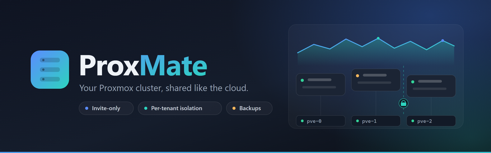
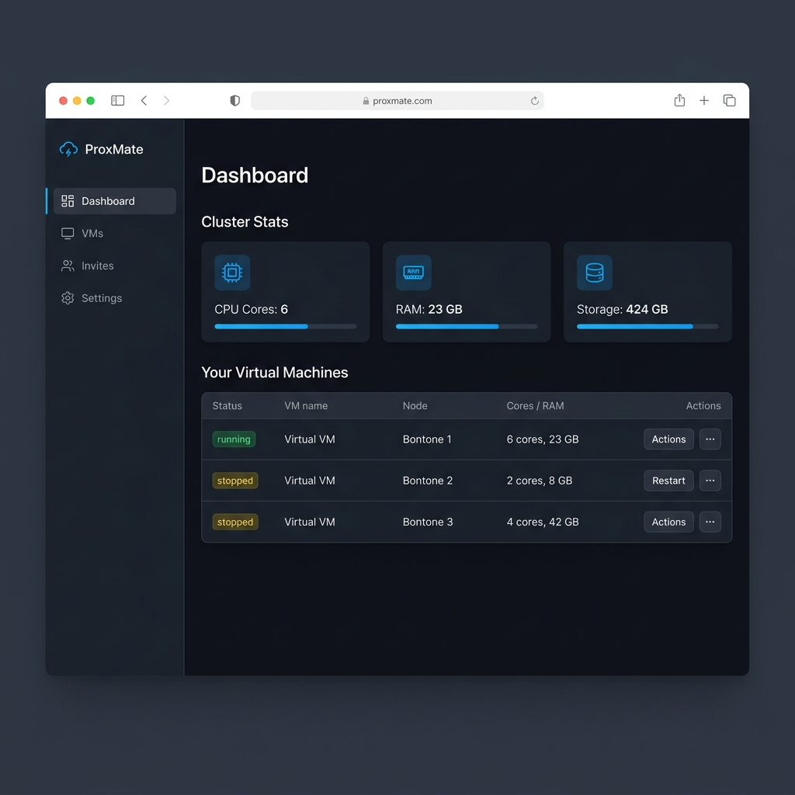
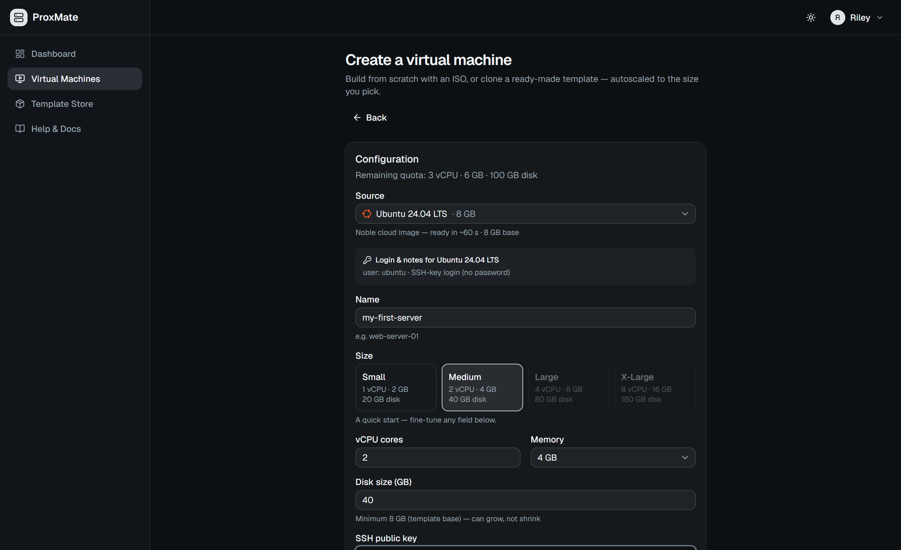
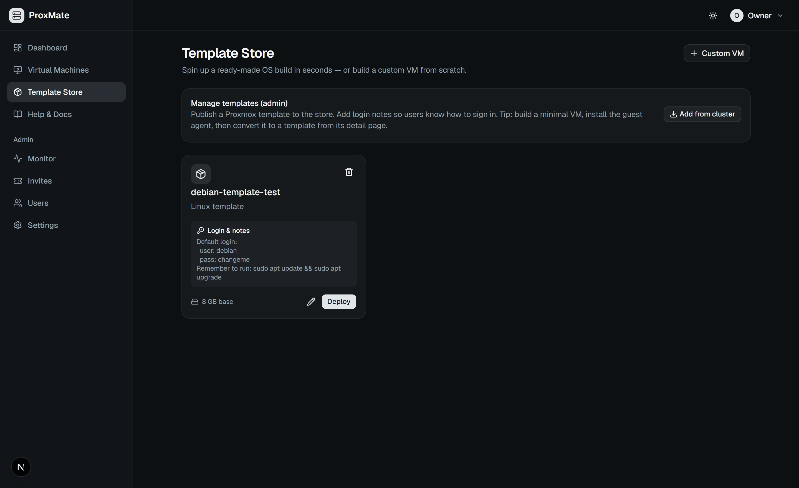
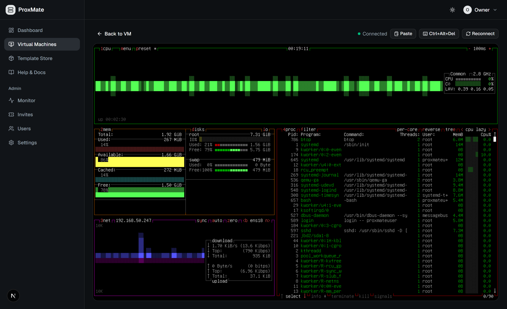
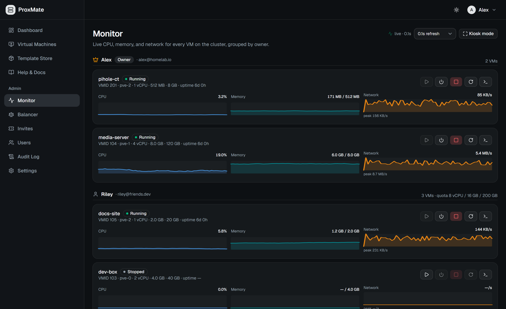
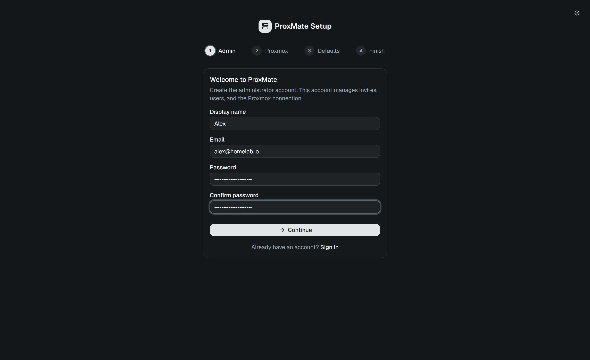

<div align="center">



<br/>

<p>
  <a href="https://github.com/r0073d-l053r/ProxMate/blob/main/LICENSE"></a>
  
  
  
  
  <a href="https://github.com/r0073d-l053r/ProxMate/actions/workflows/ci.yml"></a>
</p>

**A lightweight, invite-only cloud dashboard built on Proxmox VE.**

ProxMate gives you a DigitalOcean-style WebUI on top of your existing Proxmox cluster. Generate invite links with resource quotas, let users spin up VMs from an ISO **or a one-click cloud image** (paste an SSH key → a ready-to-SSH box in ~60s), and access them via an in-browser noVNC console — all without exposing your Proxmox admin panel.

</div>

---

## ✨ Features

| Feature | Description |
|---|---|
| 🔒 **Invite-Only Registration** | Admin-generated invite links with CPU/RAM/Storage quotas, with optional **enforced 2FA** on registration |
| 🛡️ **Multi-Factor Auth (MFA/2FA)** | Secure accounts via TOTP (authenticator apps) with recovery codes, or passwordless **Passkeys (WebAuthn)** using biometric keys |
| 🔑 **Single Sign-On (OIDC SSO)** | Bring-your-own SSO (Keycloak, Authentik, etc.) with custom group-to-admin mapping and optional JIT user provisioning |
| ✉️ **SMTP & Password Recovery** | Email-based secure password resets, with a database-backed "contact admin" request queue if SMTP is disabled |
| 🖥️ **VM Lifecycle Management** | Create, start, stop, restart, and delete VMs from a sleek dashboard |
| ☁️ **Cloud-Init Deploys** | One-click cloud images (16 curated distros + custom URLs), imported entirely through the Proxmox API — paste an SSH key for a ready-to-SSH box in ~60s, with optional first-boot **Docker** / **Tailscale** installs |
| 📦 **Template Store** | Publish Proxmox templates as one-click OS builds — cloned and autoscaled on deploy, with OS-matched (or custom-uploaded) icons and admin-authored login notes |
| ⚖️ **Automatic VM Placement** | Tenants never pick a node — the scheduler auto-places each VM on a node that has the chosen image, with the most free capacity |
| 🌐 **In-Browser Console** | noVNC remote access in the browser, proxied securely through the backend — with copy-paste into the VM (fixed std VGA console display for Cloud-init templates) |
| 💾 **MateStates Backups** | Scheduled weekly snapshots + one-click in-place restore, with rolling retention |
| 📈 **Live Admin Monitor** | Per-VM CPU / memory / network sparklines at 1 Hz, with power controls, grouped by owner |
| 🛡️ **Tenant Network Isolation** | Per-VM Proxmox firewall — MAC filtering, RFC1918 drop rules, and a configurable DNS allow-list — keeps guests off your LAN, your other VMs, and the host |
| 📝 **Audit Log** | Who created / deleted / restored / started which VM, plus sign-ins — an admin-viewable activity trail |
| 🚦 **Rate Limiting** | Built-in brute-force protection on the login / register / invite endpoints |
| 📊 **Resource Quotas** | Users can only provision resources within their assigned limits |
| 🧙 **First-Time Setup Wizard** | Guided OOBE to configure admin credentials and the Proxmox connection |
| 🐳 **Docker + CI** | Multi-stage production images, plus GitHub Actions CI (typecheck, tests, image builds) and an automated test suite |

---

## 📸 Screenshots

<div align="center">

### Admin Dashboard

*Live cluster capacity and every virtual machine at a glance*

### Create a VM

*One wizard for custom (ISO), template, and cloud-init deploys — paste an SSH key and tenants are auto-placed on the best node*

### Template Store

*Add cloud images in one click and publish ready-made OS builds — OS-matched icons, login notes, deploy in seconds*

### In-Browser Console

*A live, interactive noVNC session on your VM — copy/paste and Ctrl+Alt+Del, no SSH or open ports needed*

### Live Monitor

*Per-VM CPU / memory / network sparklines at 1 Hz, with power controls*

### First-Time Setup

*Guided wizard to create the admin account and connect your Proxmox cluster*

</div>

---

## 🛠️ Tech Stack

| Layer | Technology |
|---|---|
| **Frontend** | Next.js 16 (App Router), TailwindCSS v4, Shadcn/UI (Base UI), react-icons |
| **Backend** | Node.js, Express 5, `ws` (WebSocket relay), `express-rate-limit`, `node-cron`, `nodemailer` |
| **Database** | SQLite via Prisma ORM (migrations) |
| **Auth** | JWT + bcrypt, OIDC SSO (`openid-client`), Passkeys (`@simplewebauthn/server`), TOTP 2FA (`otplib`), SMTP |
| **Proxmox** | REST API with API Token authentication |
| **Console** | noVNC WebSocket proxy |
| **Testing / CI** | Vitest, GitHub Actions |

---

## 🚀 Getting Started

### Prerequisites

- **Node.js** 20+ and **npm**
- **Proxmox VE** cluster with API access (tested against PVE 9.2)
- A **Proxmox API Token** ([how to create one](https://pve.proxmox.com/wiki/User_Management#pveum_tokens))

> ⚠️ **Important — API token permissions.** Proxmox creates API tokens with **Privilege Separation enabled** by default, which gives the token an *empty* permission set (even for `root`). ProxMate needs the token to actually have privileges, so either **uncheck "Privilege Separation"** when creating the token, or grant the token a role:
> ```bash
> # Option A: disable privilege separation (simplest)
> pveum user token modify root@pam proxmate --privsep 0
>
> # Option B: keep privsep, grant the token Administrator on /
> pveum acl modify / --tokens 'root@pam!proxmate' --roles Administrator
> ```
> Symptoms of a privilege-separated token: the connection test passes but storage lists come back empty and VM creation fails with a 403.

### Development Installation

```bash
# Clone the repo
git clone https://github.com/r0073d-l053r/ProxMate.git
cd ProxMate

# Install backend dependencies
cd backend
npm install
cp ../.env.example .env       # Edit with your settings
npx prisma migrate deploy     # Create the SQLite database + apply migrations

# Install frontend dependencies
cd ../frontend
npm install

# Start both servers (in separate terminals)
cd ../backend && npm run dev   # Express API on :4000
cd ../frontend && npm run dev  # Next.js on :3000
```

### First-Time Setup

1. Open `http://localhost:3000` in your browser
2. You'll be redirected to the **Setup Wizard**
3. Follow the 4 steps:
   - **Step 1:** Create your admin account
   - **Step 2:** Enter your Proxmox host URL and API token credentials, then test the connection
   - **Step 3:** Select default storage pool, network bridge, and ISO storage from your cluster
   - **Step 4:** Review and finalize

You'll be logged in as admin and ready to generate invite links for your users.

---

## 🧪 Testing & CI

The backend ships with a [Vitest](https://vitest.dev) suite covering the security-critical
logic — quota enforcement, the per-VM firewall rule builder, node placement, MateState
retention, ownership checks, cloud-init config, and `createVm`/`deployFromTemplate`
orchestration against a mocked Proxmox API (no live cluster or DB needed):

```bash
cd backend && npm test        # or: npm run test:watch
```

Every push and PR runs **GitHub Actions** ([`.github/workflows/ci.yml`](.github/workflows/ci.yml)):
backend typecheck + tests, frontend lint + build, and a Docker build of both images.

---

## 🐳 Production Deployment (Docker)

ProxMate ships with a production `docker-compose.yml` (multi-stage builds; the API runs
migrations on startup, the frontend is a Next.js standalone server, and the SQLite DB
lives on a named volume).

```bash
# 1. Configure
cp .env.docker.example .env
#    - generate a stable encryption key:
openssl rand -hex 32          # paste into ENCRYPTION_KEY in .env
#    - set FRONTEND_URL and NEXT_PUBLIC_API_URL to the URLs your users will hit

# 2. Build and start
docker compose up -d --build

# Frontend → http://localhost:3000   API → http://localhost:4000
```

> **`ENCRYPTION_KEY` must stay constant** across restarts — it decrypts your stored Proxmox
> token and JWT secret. Back it up. `NEXT_PUBLIC_API_URL` is baked into the frontend at
> **build time**, so rebuild the frontend image if it changes.

**For a real public deployment**, serve ProxMate from a **single HTTPS origin** — passkeys,
`Secure` cookies, and the OIDC SSO callback all require it. Put a reverse proxy
(**Caddy / nginx / Traefik**, or a **Cloudflare Tunnel**) in front to terminate HTTPS and route
`/api/*` to the backend and everything else to the frontend on one domain, then set in `.env`:

```bash
FRONTEND_URL=https://proxmate.example.com
BACKEND_PUBLIC_URL=https://proxmate.example.com
NEXT_PUBLIC_API_URL=https://proxmate.example.com/api   # baked in at build time → rebuild if changed
WEBAUTHN_RP_ID=proxmate.example.com
WEBAUTHN_ORIGIN=https://proxmate.example.com
COOKIE_SECURE=true
TRUST_PROXY=1            # real client IP for rate-limiting + audit behind the proxy
BIND_ADDR=127.0.0.1     # only the local reverse proxy can reach the app ports
```

See **[DEPLOYMENT.md](./DEPLOYMENT.md)** for the full production runbook (reverse-proxy /
Cloudflare-Tunnel topology, tenant isolation, Keycloak OIDC SSO, SMTP, and the 2FA test matrix)
and **[SECURITY.md](./SECURITY.md)** for the hardening guide.

---

## 🔐 Security

ProxMate is designed for sharing resources with people you don't fully trust (friends,
family). It ships with tenant **network isolation** (a per-VM Proxmox firewall), **rate
limiting** on the auth/invite endpoints, and an **audit log** of VM and sign-in activity.

Before going public, read **[SECURITY.md](./SECURITY.md)** — it covers the isolation model
(keeping guests off your LAN and away from your other VMs/host), the required Proxmox
cluster-firewall step, least-privilege API tokens, and a production hardening checklist.

---

## 📚 Documentation

**[`docs/`](./docs/)** has the user- and admin-facing guides:

- **[Production Deployment Runbook](./DEPLOYMENT.md)** — owners: step-by-step production setup guide including Caddy, Keycloak OIDC SSO, SMTP email config, and 2FA verification.
- **[External access overview](./docs/external-access.md)** — the "no port forwarding" rule and which tool to pick for each use case.
- **[Tailscale for SSH](./docs/tailscale-ssh.md)** — tenants: SSH into your VM from anywhere, no public IP needed.
- **[Cloudflare Tunnels](./docs/cloudflare-tunnels.md)** — tenants: publish a public website from your VM without forwarding any port.
- **[Admin guide](./docs/admin-guide.md)** — owners: cluster setup, firewall enforcement, adding cloud images, authentication settings (SMTP, MFA, OIDC SSO), and shipping a tenant-ready Linux template.

All of these are also surfaced inside the app under **Help & Docs** in the sidebar.

---

## 📁 Project Structure

```
ProxMate/
├── frontend/             # Next.js dashboard + setup wizard
├── backend/              # Express API + Proxmox proxy + WebSocket relay (+ Vitest tests)
├── docs/                 # User + admin guides (Tailscale, Cloudflare, etc.)
├── .github/workflows/    # CI — typecheck, tests, Docker build
├── docker-compose.yml    # Production orchestration
├── SECURITY.md           # Hardening guide
└── project-architecture.md  # Full architecture spec
```

See [project-architecture.md](./project-architecture.md) for the complete specification.

---

## Community and Discussions

If you need help configuring ProxMate, want to suggest new features, or would like to share your virtual environment setup, we welcome you to join our discussions:
- [General Discussions](https://github.com/r0073d-l053r/ProxMate/discussions/categories/general): Introduce yourself, meet other self-hosters, and talk about virtualization.
- [Questions and Answers](https://github.com/r0073d-l053r/ProxMate/discussions/categories/q-a): Troubleshoot setup issues and get help from the community.
- [Ideas and Feature Proposals](https://github.com/r0073d-l053r/ProxMate/discussions/categories/ideas): Suggest new dashboard capabilities and optimizations.
- [Show and Tell](https://github.com/r0073d-l053r/ProxMate/discussions/categories/show-and-tell): Share your homelab architectures and custom ProxMate dashboards.

We are committed to building a welcoming and collaborative space. Please check our [Contributing Guide](CONTRIBUTING.md) to learn how to get involved.

---

## License

GNU Affero General Public License v3.0 (AGPLv3) — see the [LICENSE](./LICENSE) file for details.

---

<div align="center">
  <sub>Built by the ProxMate team.</sub>
</div>
