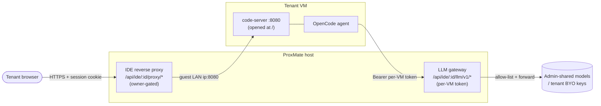

# ProxMate IDE (in-guest code-server + AI agent)

The ProxMate IDE gives each tenant a **full VS Code editor in the browser**, running
**inside their own VM**, with an **OpenCode AI agent** wired to models the admin controls.
No SSH, no separate login — one click on a VM opens the editor at that machine's root, with
a terminal that *is* the VM.

- **For tenants:** a browser IDE + AI coding agent for the VM you already own.
- **For admins:** you choose whether it's available, which AI models it can use, and the
  IDE reuses the same tenant-isolation firewall as everything else.

---

## What it is

- **Editor transport:** the browser talks to ProxMate over your one HTTPS origin; ProxMate
  reverse-proxies to the guest's own `code-server` on `:8080`. Auth is the ProxMate session
  cookie + VM ownership — the same gate as the noVNC console.
- **AI transport:** the in-guest OpenCode agent calls ProxMate's OpenAI-compatible **LLM
  gateway** with a **per-VM bearer token**. The gateway enforces the admin's model allow-list
  and forwards to the real upstream. The tenant never sees the upstream endpoint or key.

The IDE is installed **lazily** — on the first "Open IDE", ProxMate installs code-server +
OpenCode into the VM through the QEMU guest agent and opens the editor when it's ready. The VM
is locked (no stop/delete/console) during the install.

---

## For tenants (using it)

1. Open one of your VMs → **Console ▸ Open IDE** (desktop only; the IDE is a pop-out editor).
2. First time on a VM: it installs for ~a minute (you can navigate away and come back).
3. You get VS Code in the browser, opened at the VM's root, with a terminal on the VM and the
   **OpenCode** AI agent already running.
4. **Models:** the model picker shows what your admin shared. If your admin allows it, add your
   **own** API key under **Security ▸ AI keys** (it's used only through ProxMate, never exposed).
   Tenants pick from the offered providers (OpenAI, OpenRouter, Groq); a **custom endpoint URL is
   admin-only** — ask your admin to share the model instead.

**Requirements for a VM to run the IDE:** the QEMU guest agent must be running, the VM needs
**at least 8 GB RAM** (the editor + AI agent are heavy), and a CPU with AVX. ProxMate handles the
CPU automatically; if it asks you to **reboot and reopen**, that's it enabling AVX (the AI agent
needs it). If the node's own hardware can't do AVX, ProxMate offers a **one-click move** to a
capable node instead — the VM shuts down, moves, starts again, and the IDE opens automatically.

On a VM that's been **shared with you**, the IDE needs the **Manager** share level.

---

## For admins (enabling + controlling it)

Admin **Settings ▸ ProxMate IDE**:

- **Availability tier:** `off`, `admins only`, or `all tenants`.
- **Model source:** add an **OpenAI-compatible endpoint** (a local Ollama, vLLM, OpenRouter, …).
  Admins may point a source at a **LAN address** (e.g. `http://192.168.x:11434/v1`) — use **Test**
  to confirm it reaches the endpoint and lists models.
- **Shared models + visibility:** pick which of the source's models tenants see (`shared`),
  which only admins see (`admin`), or neither (`none`).
- **Bring-your-own keys:** toggle whether tenants may add their own provider keys. Tenant keys are
  **held to public endpoints** (an SSRF guard blocks private/loopback/metadata addresses) and to the
  **fixed preset providers** — a free-form custom base URL is admin-only; admin keys are exempt so
  LAN sources work.
- **`ide_ingress_cidr`:** the address ProxMate's traffic reaches the guest from (see Networking).

### Networking requirement (the one thing to get right)

The IDE is the only feature that reaches a guest **over the network** (`guest-ip:8080`) rather
than out-of-band via the Proxmox API. So:

- **The ProxMate host must be able to reach tenant VM IPs on TCP :8080.**
- On a **flat network** (ProxMate on the same LAN as the guests) this just works.
- On a **non-flat network** (ProxMate can't reach the guest VLAN directly), you provide the
  routing — a **Tailscale subnet route**, a VPN, a static route. ProxMate can't create that for you.
- With tenant isolation on, ProxMate opens a **managed, infra-scoped** `:8080` firewall pinhole on
  each IDE VM (via the Proxmox firewall API, exactly like the isolation rules). It's scoped to
  **`ide_ingress_cidr`** — the address ProxMate's traffic *arrives from* (the backend host on a flat
  LAN; the **subnet-router node's LAN IP** when routed, because subnet routes SNAT to the router).
  Set `ide_ingress_cidr` to that address; it must be specific (`0.0.0.0/0` is rejected).

---

## Security model

- **Isolation preserved.** The `:8080` pinhole is a single inbound ACCEPT scoped to the ProxMate
  infrastructure address only — the guest keeps `policy_in=DROP`, so **tenants remain isolated
  from each other**. The IDE reuses your isolation firewall; it doesn't open the guest to the LAN.
- **Ownership-gated transport.** The reverse proxy resolves each request (HTTP *and* WebSocket)
  through the per-VM capability gate — owner/admin, or a **Manager**-level share — and refuses
  loopback/link-local targets, so a spoofed guest-reported IP can't point the proxy at the host.
- **Gateway-enforced model access.** A per-VM token maps to `(user, VM)` and is re-checked live on
  every request (ownership + policy). `resolveModelRoute` is the single allow-list choke point: a
  tenant can reach only admin-shared models or — when enabled — their own BYO keys, and nothing else,
  even if they edit their in-guest config. Admin upstream endpoints and keys never leave ProxMate.
- **SSRF-guarded BYO.** Tenant key endpoints are validated to public addresses at save and again at
  forward time; admins are exempt for LAN sources.
- **Rate + size limits.** The gateway is body-capped (large chat contexts allowed, bounded) and
  rate-limited per VM so a stolen/runaway token can't hammer the upstream.

---

## Troubleshooting

| Symptom | Cause / fix |
|---|---|
| IDE opens on the **wrong VM** / every VM shows the same box | A stale `IDE_TARGET_OVERRIDE` (a rig-only escape hatch) is set — unset it; routing is per-VM by the guest's own IP. |
| Editor loads but the connection **drops / "extension host unresponsive"** | The path to the guest is unstable (e.g. a relayed/flaky link). Use a *stable* route to the guest LAN (direct LAN, or a subnet route through a well-connected node), not a best-effort peer link. |
| **"Unauthorized — missing session"** when the AI agent runs | The gateway base URL is `http://` and the edge 301-redirects to https, downgrading the POST to a GET. Ensure `TRUST_PROXY=1` and `BACKEND_PUBLIC_URL`/the origin are **https**. |
| OpenCode crashes: **"CPU lacks AVX" / illegal instruction** | The VM's CPU masks AVX. ProxMate sets `cpu: host` at IDE-enable; **reboot the VM** and reopen so it takes effect. If the node's own silicon lacks AVX, ProxMate offers a **one-click move** to a capable node (stop → move → start → IDE opens). |
| VM becomes **unresponsive right after Open IDE** | Undersized VM — the install OOMs. Give the VM **>= 8 GB RAM** (the `ide_min_ram_mb` floor) and retry. |
| **"The QEMU guest agent is not responding"** | Install + start `qemu-guest-agent` in the VM (the IDE installs through it). |
| AI agent can't reach a model / 403 | The model isn't shared to that tenant (check visibility), or BYO is disabled, or a BYO endpoint was blocked as private. |

---

*See also: [`../DEPLOYMENT.md`](../DEPLOYMENT.md), [`../DEPLOY_WITH_CLAUDE.md`](../DEPLOY_WITH_CLAUDE.md)
(agent-guided deploy), [`../SECURITY.md`](../SECURITY.md), and [`admin-guide.md`](admin-guide.md).*
