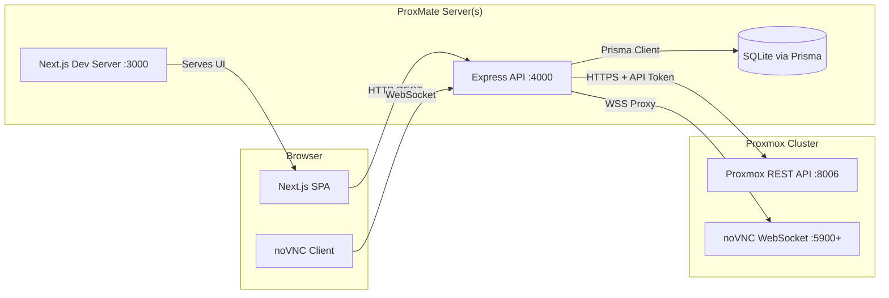
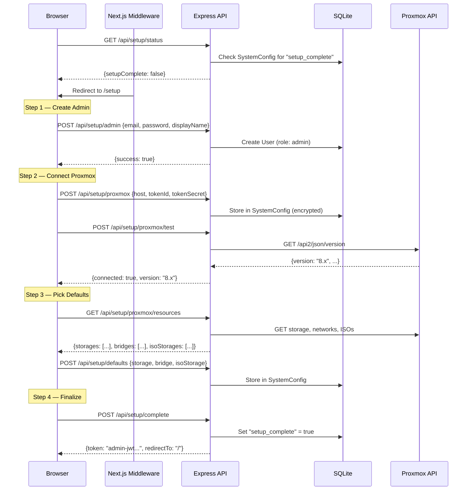
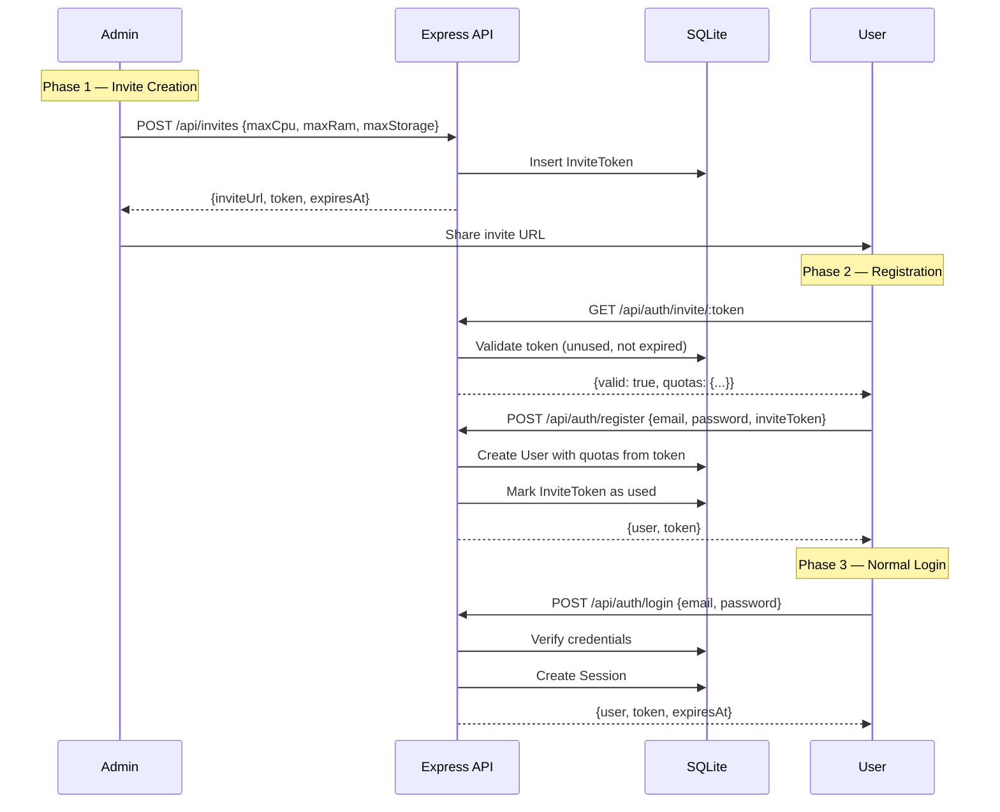
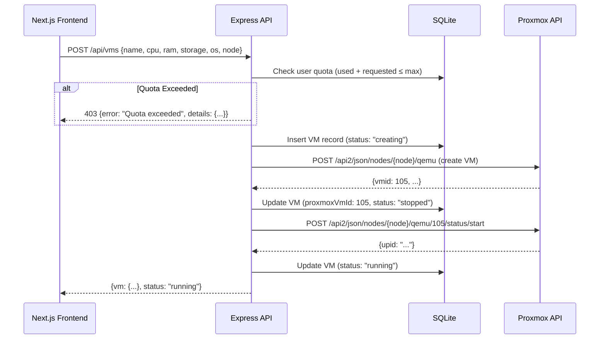
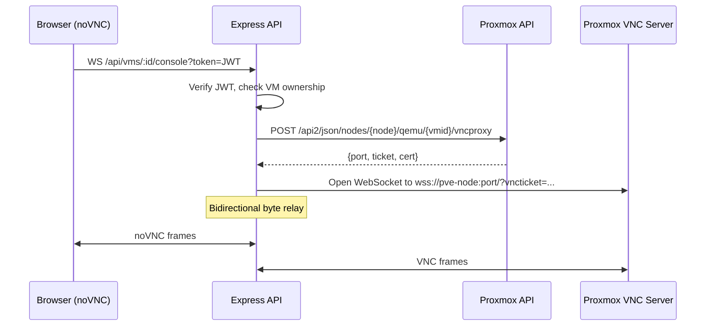

# ProxMate — Project Architecture

> A lightweight, invite-only cloud dashboard built on Proxmox VE.

---

## 1. High-Level Architecture



| Layer | Technology | Port | Purpose |
|-------|-----------|------|---------|
| Frontend | Next.js 16 (App Router), TailwindCSS v4, Shadcn/UI (Base UI) | `:3000` | Dashboard UI, VM wizard, noVNC viewer |
| Backend | Node.js + Express 5 + `ws` (WebSocket relay) | `:4000` | REST API, auth, Proxmox proxy, WS relay |
| Database | SQLite 3 via Prisma ORM | file | Users, invites, quotas, VM mappings |
| Proxmox | Proxmox VE REST API | `:8006` | VM lifecycle, ISO listing, console tickets |

---

## 2. Repository Structure

```
ProxMate/
├── frontend/                      # Next.js application
│   ├── src/
│   │   ├── app/                   # App Router pages
│   │   │   ├── (setup)/           # First-time OOBE wizard
│   │   │   │   └── setup/
│   │   │   │       ├── page.tsx           # Step 1: Welcome + admin account
│   │   │   │       ├── proxmox/page.tsx   # Step 2: Proxmox connection
│   │   │   │       ├── defaults/page.tsx  # Step 3: Storage/network defaults
│   │   │   │       └── complete/page.tsx  # Step 4: Review + finish
│   │   │   ├── (auth)/
│   │   │   │   ├── login/page.tsx
│   │   │   │   └── register/[token]/page.tsx
│   │   │   ├── (dashboard)/
│   │   │   │   ├── layout.tsx     # Sidebar + topbar shell
│   │   │   │   ├── page.tsx       # Dashboard overview
│   │   │   │   ├── vms/
│   │   │   │   │   ├── page.tsx           # VM list
│   │   │   │   │   ├── new/page.tsx       # Create VM wizard
│   │   │   │   │   └── [id]/
│   │   │   │   │       ├── page.tsx       # VM detail
│   │   │   │   │       └── console/page.tsx  # noVNC viewer
│   │   │   │   ├── admin/
│   │   │   │   │   ├── invites/page.tsx   # Invite management
│   │   │   │   │   ├── users/page.tsx     # User management
│   │   │   │   │   └── settings/page.tsx  # Re-configure Proxmox connection
│   │   │   │   └── middleware.ts   # Redirect to /setup if not configured
│   │   │   ├── layout.tsx         # Root layout
│   │   │   └── globals.css
│   │   ├── components/
│   │   │   ├── ui/                # Shadcn/UI primitives
│   │   │   ├── dashboard/         # Dashboard-specific components
│   │   │   ├── vm/                # VM cards, forms, status badges
│   │   │   └── console/           # noVNC wrapper component
│   │   ├── lib/
│   │   │   ├── api.ts             # Fetch wrapper for Express API
│   │   │   ├── auth.ts            # Auth context / helpers
│   │   │   └── utils.ts           # Shared utilities
│   │   └── hooks/
│   │       ├── use-auth.ts
│   │       └── use-vms.ts
│   ├── public/
│   ├── tailwind.config.ts
│   ├── next.config.ts
│   ├── tsconfig.json
│   └── package.json
│
├── backend/                       # Express API server
│   ├── src/
│   │   ├── index.ts               # Server entry point
│   │   ├── app.ts                 # Express app setup
│   │   ├── config/
│   │   │   └── env.ts             # Environment variable loader
│   │   ├── middleware/
│   │   │   ├── auth.ts            # JWT verification middleware
│   │   │   ├── admin.ts           # Admin-only guard
│   │   │   ├── cors.ts            # CORS configuration
│   │   │   └── errorHandler.ts    # Global error handler
│   │   ├── routes/
│   │   │   ├── setup.routes.ts    # /api/setup/* (OOBE wizard)
│   │   │   ├── auth.routes.ts     # /api/auth/*
│   │   │   ├── invite.routes.ts   # /api/invites/*
│   │   │   ├── vm.routes.ts       # /api/vms/*
│   │   │   ├── proxmox.routes.ts  # /api/proxmox/* (ISOs, nodes)
│   │   │   └── console.routes.ts  # /api/vms/:id/console (WS)
│   │   ├── services/
│   │   │   ├── auth.service.ts    # Password hashing, JWT signing
│   │   │   ├── invite.service.ts  # Token generation & validation
│   │   │   ├── proxmox.service.ts # Proxmox REST API wrapper
│   │   │   ├── vm.service.ts      # VM lifecycle orchestration
│   │   │   ├── vnc-proxy.service.ts # WebSocket relay to Proxmox
│   │   │   └── setup.service.ts   # First-time config + admin creation
│   │   └── types/
│   │       └── index.ts           # Shared TypeScript types
│   ├── prisma/
│   │   ├── schema.prisma          # Database schema
│   │   └── migrations/
│   ├── tsconfig.json
│   └── package.json
│
├── .env.example                   # Template for secrets
├── project-architecture.md        # This file
└── README.md
```

---

## 3. Database Schema (Prisma)

```prisma
generator client {
  provider = "prisma-client-js"
}

datasource db {
  provider = "sqlite"
  url      = env("DATABASE_URL") // file:./proxmate.db
}

model User {
  id            String    @id @default(cuid())
  email         String    @unique
  passwordHash  String
  displayName   String
  role          String    @default("user") // "admin" | "user"

  // Resource Quotas (set from invite token at registration)
  maxCpu        Int       @default(0)      // total vCPU cores allowed
  maxRam        Int       @default(0)      // total RAM in MB
  maxStorage    Int       @default(0)      // total disk in GB

  createdAt     DateTime  @default(now())
  updatedAt     DateTime  @updatedAt

  vms           VirtualMachine[]
  invitesCreated InviteToken[]  @relation("CreatedInvites")
  usedInvite    InviteToken?   @relation("UsedInvite")

  sessions      Session[]
}

model Session {
  id          String   @id @default(cuid())
  userId      String
  token       String   @unique           // JWT jti or refresh token
  expiresAt   DateTime
  createdAt   DateTime @default(now())

  user        User     @relation(fields: [userId], references: [id], onDelete: Cascade)

  @@index([token])
  @@index([userId])
}

model InviteToken {
  id          String    @id @default(cuid())
  token       String    @unique          // Crypto-random URL-safe string
  createdById String
  label       String?                    // Optional admin note

  // Quota caps embedded in the invite
  maxCpu      Int                        // vCPU cores
  maxRam      Int                        // RAM in MB
  maxStorage  Int                        // Disk in GB

  usedById    String?   @unique          // Null until redeemed
  expiresAt   DateTime
  createdAt   DateTime  @default(now())

  createdBy   User      @relation("CreatedInvites", fields: [createdById], references: [id])
  usedBy      User?     @relation("UsedInvite", fields: [usedById], references: [id])

  @@index([token])
}

model VirtualMachine {
  id            String    @id @default(cuid())
  userId        String
  proxmoxVmId   Int                      // VMID on Proxmox cluster
  proxmoxNode   String                   // Target node name
  name          String
  description   String?

  // Allocated resources
  cpu           Int                      // vCPU cores
  ram           Int                      // RAM in MB
  storage       Int                      // Disk in GB
  os            String                   // ISO filename

  status        String    @default("creating") // creating | running | stopped | error
  ipAddress     String?                  // Populated after DHCP/cloud-init

  createdAt     DateTime  @default(now())
  updatedAt     DateTime  @updatedAt

  user          User      @relation(fields: [userId], references: [id], onDelete: Cascade)

  @@index([userId])
  @@index([proxmoxVmId])
}

// Stores application config set during first-time setup (OOBE)
// Key-value store so new settings can be added without migrations
model SystemConfig {
  key         String    @id              // e.g. "proxmox_host", "setup_complete"
  value       String                     // Stored as string, parsed by app
  sensitive   Boolean   @default(false)  // If true, value is AES-encrypted
  updatedAt   DateTime  @updatedAt
}
```

---

## 4. API Routes

### 4.0 First-Time Setup (OOBE)

All `/api/setup/*` routes are **only accessible when `setup_complete` is not set** in `SystemConfig`. Once setup finishes, they return `403`.

| Method | Endpoint | Auth | Description |
|--------|----------|------|-------------|
| `GET`  | `/api/setup/status` | Public | Returns `{ setupComplete: boolean }` — used by frontend middleware to redirect |
| `POST` | `/api/setup/admin` | Public* | Create the initial admin account (email, password, displayName) |
| `POST` | `/api/setup/proxmox` | Public* | Save Proxmox connection config (host, tokenId, tokenSecret, verifySsl) |
| `POST` | `/api/setup/proxmox/test` | Public* | Test the Proxmox connection and return cluster info (nodes, version) |
| `GET`  | `/api/setup/proxmox/resources` | Public* | Fetch available storage pools, network bridges, ISO storages from Proxmox |
| `POST` | `/api/setup/defaults` | Public* | Save default VM settings (storage pool, network bridge, ISO storage) |
| `POST` | `/api/setup/complete` | Public* | Finalize setup — sets `setup_complete=true`, generates JWT_SECRET, returns admin JWT |

> \* These routes are "public" only during first-time setup. The `setupGuard` middleware blocks them entirely once setup is complete.

**Setup wizard steps in the frontend:**

| Step | Page | What the admin sees |
|------|------|---------------------|
| 1 | `/setup` | Welcome message, create admin email + password + display name |
| 2 | `/setup/proxmox` | Enter Proxmox host URL, API Token ID, API Token Secret, SSL toggle — with a "Test Connection" button |
| 3 | `/setup/defaults` | Dropdowns auto-populated from Proxmox: pick default storage pool, network bridge, ISO storage location |
| 4 | `/setup/complete` | Review all settings, confirm, and launch into the dashboard |

### 4.1 Authentication

| Method | Endpoint | Auth | Description |
|--------|----------|------|-------------|
| `POST` | `/api/auth/register` | Public | Create account with a valid invite token |
| `POST` | `/api/auth/login` | Public | Email + password → JWT |
| `POST` | `/api/auth/logout` | User | Invalidate session |
| `GET`  | `/api/auth/me` | User | Return current user + quota usage |
| `GET`  | `/api/auth/invite/:token` | Public | Validate invite token (pre-registration check) |

**Register Request Body:**
```json
{
  "email": "user@example.com",
  "password": "securePass123",
  "displayName": "Jane Doe",
  "inviteToken": "abc123xyz"
}
```

**Login Response:**
```json
{
  "user": { "id": "...", "email": "...", "role": "user", "displayName": "..." },
  "token": "eyJhbGciOi...",
  "expiresAt": "2026-06-23T12:00:00Z"
}
```

### 4.2 Admin — Invite Management

| Method | Endpoint | Auth | Description |
|--------|----------|------|-------------|
| `POST` | `/api/invites` | Admin | Generate a new invite link |
| `GET`  | `/api/invites` | Admin | List all invites with status |
| `DELETE` | `/api/invites/:id` | Admin | Revoke an unused invite |

**Create Invite Request:**
```json
{
  "maxCpu": 4,
  "maxRam": 8192,
  "maxStorage": 100,
  "label": "Dev team member",
  "expiresIn": "7d"
}
```

**Create Invite Response:**
```json
{
  "id": "...",
  "inviteUrl": "https://proxmate.local/register/abc123xyz",
  "token": "abc123xyz",
  "expiresAt": "2026-06-29T23:28:00Z"
}
```

### 4.3 Virtual Machines

| Method | Endpoint | Auth | Description |
|--------|----------|------|-------------|
| `GET`  | `/api/vms` | User | List user's VMs (admin sees all) |
| `POST` | `/api/vms` | User | Create a new VM |
| `GET`  | `/api/vms/:id` | User | VM detail + live Proxmox status |
| `DELETE` | `/api/vms/:id` | User | Destroy VM (Proxmox + DB) |
| `POST` | `/api/vms/:id/start` | User | Start VM |
| `POST` | `/api/vms/:id/stop` | User | Stop VM (graceful shutdown) |
| `POST` | `/api/vms/:id/stop?force=true` | User | Force stop VM |
| `POST` | `/api/vms/:id/restart` | User | Restart VM |

**Create VM Request:**
```json
{
  "name": "my-web-server",
  "cpu": 2,
  "ram": 2048,
  "storage": 20,
  "os": "ubuntu-24.04-live-server-amd64.iso",
  "node": "pve-node-01"
}
```

### 4.4 Proxmox Resources

| Method | Endpoint | Auth | Description |
|--------|----------|------|-------------|
| `GET`  | `/api/proxmox/nodes` | User | List available Proxmox nodes |
| `GET`  | `/api/proxmox/isos` | User | List ISOs available on the cluster |
| `GET`  | `/api/proxmox/storage` | User | List storage pools (Ceph, local, etc.) |

### 4.5 Console (WebSocket)

| Protocol | Endpoint | Auth | Description |
|----------|----------|------|-------------|
| `WS` | `/api/vms/:id/console` | User (token query param) | Proxied noVNC WebSocket connection |

---

## 5. First-Time Setup (OOBE) Flow



---

## 6. Auth Flow



---

## 7. VM Creation Flow



---

## 8. noVNC Console Proxy Flow



**Key implementation details:**
- The Express server uses `express-ws` to handle the incoming WebSocket upgrade from the browser.
- On connection, it requests a VNC ticket from Proxmox's `/vncproxy` endpoint.
- It opens a *second* WebSocket to the Proxmox node using that ticket.
- It then pipes data bidirectionally between the browser and Proxmox.
- The noVNC client on the frontend connects to `ws://proxmate-api:4000/api/vms/:id/console`.

---

## 9. Environment Variables

> **Note:** Proxmox credentials and default VM settings are now configured through the setup wizard and stored in the `SystemConfig` database table (encrypted for sensitive values). The `.env` file only needs server-level config.

```env
# ─── Backend (.env) ──────────────────────────────────────────
# Server
PORT=4000
NODE_ENV=development
FRONTEND_URL=http://localhost:3000

# Database
DATABASE_URL="file:./proxmate.db"

# Encryption key for SystemConfig sensitive values (auto-generated on first setup)
ENCRYPTION_KEY=<auto-generated-on-setup>

# ─── Frontend (.env.local) ───────────────────────────────────
NEXT_PUBLIC_API_URL=http://localhost:4000/api
```

**Values stored in SystemConfig (set via setup wizard):**
| Key | Sensitive | Description |
|-----|-----------|-------------|
| `setup_complete` | No | Whether OOBE has been completed |
| `jwt_secret` | Yes | Auto-generated JWT signing secret |
| `proxmox_host` | No | Proxmox API URL (e.g. `https://192.168.1.100:8006`) |
| `proxmox_token_id` | No | API Token ID (e.g. `proxmate@pam!token`) |
| `proxmox_token_secret` | Yes | API Token Secret |
| `proxmox_verify_ssl` | No | Whether to verify Proxmox TLS certs |
| `default_storage` | No | Default Ceph/storage pool for VM disks |
| `default_bridge` | No | Default network bridge |
| `iso_storage` | No | Storage location for ISOs |

---

## 10. Key Dependencies

### Backend (`backend/package.json`)
| Package | Purpose |
|---------|---------|
| `express` | HTTP framework |
| `express-ws` | WebSocket support on Express |
| `@prisma/client` + `prisma` | ORM + SQLite |
| `bcryptjs` | Password hashing |
| `jsonwebtoken` | JWT auth |
| `cors` | CORS middleware |
| `helmet` | Security headers |
| `zod` | Request validation |
| `axios` | Proxmox API calls |
| `ws` | WebSocket client (for Proxmox relay) |
| `dotenv` | Environment variables |
| `tsx` | TypeScript execution (dev) |
| `typescript` | Type safety |

### Frontend (`frontend/package.json`)
| Package | Purpose |
|---------|---------|
| `next` | React meta-framework |
| `react` / `react-dom` | UI library |
| `tailwindcss` | Utility-first CSS |
| `@shadcn/ui` components | Pre-built accessible components |
| `@novnc/novnc` | VNC client for browser |
| `lucide-react` | Icon library |
| `zustand` | Lightweight state management |
| `axios` | API calls |
| `zod` | Client-side validation |
| `class-variance-authority` | Component variants (Shadcn dep) |
| `clsx` + `tailwind-merge` | Class utilities |

---

## 11. Security Considerations

| Concern | Mitigation |
|---------|-----------|
| **Tenant network isolation** | Per-VM Proxmox firewall blocks RFC1918 (LAN, other VMs, host) while allowing internet — see [SECURITY.md](./SECURITY.md). **Requires the Proxmox cluster firewall to be enabled to take effect.** |
| Cross-tenant access (app layer) | Every VM/console action is authorized via `getOwnedVm`; quotas enforced per user |
| Proxmox credentials in client | Proxmox API token **never** leaves the Express backend; stored AES-256-GCM encrypted |
| VM-create param injection | `name`, `os`, and `node` strictly validated (no comma/path injection into Proxmox config) |
| Invite token brute-force | Tokens are 32-byte crypto-random, single-use (atomic claim), with expiry. ⚠️ App-level rate limiting is **not** built in — add it at the reverse proxy |
| Account enumeration | Login runs bcrypt even for unknown emails (constant-time-ish) |
| JWT theft | 24h JWTs with random `jti`; backed by a `Session` row for server-side revocation. ⚠️ Token is stored in **localStorage** (not httpOnly cookies) — XSS-readable; mitigate via strict CSP and consider a cookie-based session for hardening |
| NoVNC hijacking | WebSocket upgrade requires valid JWT; VM ownership verified before proxy starts; one-time VNC tickets |
| SQL injection | Prisma parameterized queries; Zod input validation |
| XSS | React/Next.js built-in escaping; add a Content-Security-Policy at the proxy (Helmet is enabled but CSP is not configured) |
| CORS | Strict origin whitelist (only `FRONTEND_URL`) |
| Proxmox TLS | `verifySsl` flag in stored config; production should use valid certificates |

---

## 12. Phase Execution Plan

| Phase | Scope | Deliverables |
|-------|-------|-------------|
| **1. Architecture & Scaffolding** | This document + project initialization | Monorepo structure, dependency install, dev scripts |
| **2. Database, Auth & Setup Wizard** | Prisma schema, migrations, OOBE endpoints, auth endpoints | Setup wizard backend, register/login/logout, invite CRUD, JWT middleware |
| **3. Proxmox API Wrapper** | `proxmox.service.ts` + resource routes | List nodes, list ISOs, create/delete/start/stop VMs, status polling |
| **4. Frontend Dashboard & OOBE UI** | Next.js pages + components | Setup wizard UI, login, register, VM list, VM create wizard, admin panel |
| **5. VNC Proxy** | WebSocket relay + noVNC integration | Console page, bidirectional WS proxy, connection lifecycle |

---

## 13. Implementation Addendum (post-build deltas)

All 5 phases are complete and validated against a real Proxmox VE 9.2 cluster. Notable
deltas from the original spec above:

**Endpoints added beyond the original API tables:**
- `GET /api/proxmox/resources` — storages/bridges/ISO-storages (authed; used by VM-create + settings)
- `GET /api/users`, `DELETE /api/users/:id` — admin user management
- `GET /api/admin/settings`, `PUT /api/admin/settings/proxmox`, `POST /api/admin/settings/proxmox/test`, `PUT /api/admin/settings/defaults` — post-setup reconfiguration
- `GET /api/admin/isolation`, `PUT /api/admin/isolation` — tenant network-isolation status/toggle
- `POST /api/vms/:id/console` — issues the one-time VNC ticket consumed by the console WebSocket

**Deviations:**
- **Next.js 16**, not 15 — middleware is now `proxy.ts` and is discouraged for auth, so
  setup/auth gating is done with **client-side guards**, not the `middleware.ts` shown in the
  repo-structure sketch. UI primitives are shadcn on **Base UI**.
- The console WebSocket relay uses the **`ws`** library on the HTTP `upgrade` event (not
  `express-ws`), for Express 5 compatibility.
- JWT is stored in **localStorage** (not httpOnly cookies as section 11 originally implied).
- **Containers (LXC) are not implemented** — ProxMate provisions QEMU VMs only. The isolation
  model would extend to LXC if added.
- Default storage dropdown is filtered to **images-capable** pools; per-VM **firewall isolation**
  is applied on create (see [SECURITY.md](./SECURITY.md)).

*Originally generated for Phase 1; addendum added after Phase 5 + security review.*
